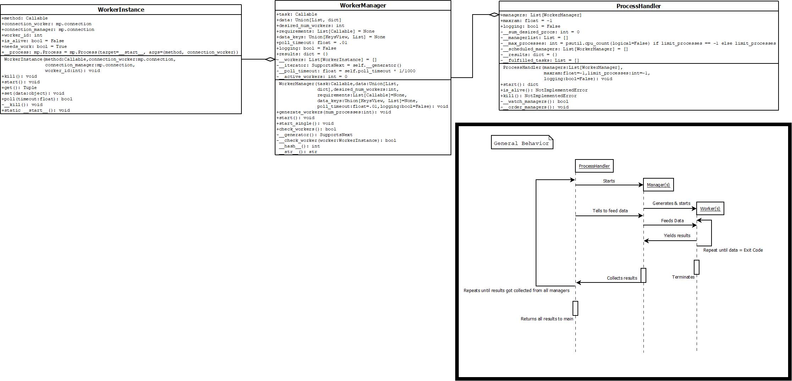

# Pipe-Based multi-pool processing

Framework to make handling multiple intertwined large tasks easier. 

### img headline
img description
TODO: make UML diagram

### Performance

There are several demos located in the demos directory also here's a table for single tasks that do not interfere with
each other, note that this isn't the keypoint of this implementation:

| Description                                   | `easy_multiprocessing`: listmode                                                           | `easy_multiprocessing`: dictmode | `multiprocessing.Pool().map()`                       | single thread     |
|:----------------------------------------------|:-------------------------------------------------------------------------------------------|:---------------------------------|:-----------------------------------------------------|:------------------|
| time of prime calculator n = 200_000, 500_000 | 10.3s,  ***54.1s***                                         | 10.4s, 54.1s                     |  ***10.1s*** , 60.1s  | 56.1s, 317.7s     |
| relative speed of fastest test                | 97.9%,  ***100%***                                          | 97.1%, 100%                      |  ***100%***  , 90.0%  | 18.0%, 17.0%      |
|                                               |                                                                                            |                                  |                                                      |                   |
| time of big factorials n = 20_000, 50_000     |  ***7.4s*** ,  ***90.6s***   | 7.7s, 102.4s                     | 9.6s, 110.7s                                         | 44.8s, 576.64s    |
| relative speed of fastest test                | ***100%*** , ***100%***      | 96.4%, 92.5%                     | 77.4%, 81.8%                                         | 16.5%, 15.76%     |

| Description                          | `easy_multiprocessing`: `Handler`              | `multiprocessing.Pool().map()` - iteratively |
|:-------------------------------------|:-----------------------------------------------|:---------------------------------------------|
| is_prime + get_factorial, n = 50_000 |  ***93.239s***  | 112.735s                                     |
| relative speed of fastest test       |  ***100%***     | 82.6%                                        |
|                                      |                                                |                                              |
|                                      |                                                |                                              |

All times have been measured on an i5-12600k with 32GB of Memory and the `Manager`'s and `pool` got each 8 processes.  
The concept of this implementation is not to split the whole dataset and let each process work, but to send data just-in-time
to remove the need of shared memory and the likes.
Additionally the `Manager` returns a somehow ordered dictionary containing the results. Each result gets mapped to the entered data/key.
I noticed this implementation to be more efficient, the longer a task runs.
Though all of the tests were made with native python which is rather slow at doing mathematical calculations, keep in mind that this is a proof of concept.
The speedup will be kept if you use C modules aswell, though it might fall off or
be a slowdown if you use this package wrongly. **This implementation aims to accelerate long-term tasks.**
